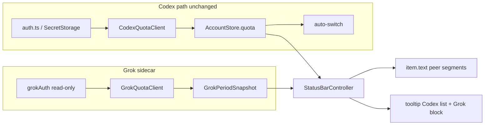

# Grok Period Remaining Display - Plan

## Goal Capsule

- **Objective:** Let a VS Code user see **Grok Build 周期剩余百分比** next to Codex on one multi-product status strip, with hover reset/update detail, without opening Grok TUI `/usage`.
- **Product authority:** Product Contract below (from `ce-brainstorm`). This plan owns **display of the current machine's logged-in Grok period remaining** in the existing extension status bar and tooltip. It does not own Grok multi-account management, auto-switch, or Grok CLI changes.
- **Execution profile:** Standard feature; external non-stable Grok usage integration isolated in a dedicated client; Codex multi-account path stays untouched for auto-switch and store.
- **Open blockers:** None for product or architecture gates. Exact Grok usage HTTP path is an **implementation discovery** step inside U1 (align with Grok `/usage`; fail soft to placeholder if period % is unavailable).
- **Stop conditions:** Stop if no honest period remaining % can be derived without inventing windows — ship placeholder path only and document the gap, rather than fake `7d` or `0%`.
- **Tail ownership:** Implementer runs `npm run compile` and `npm test`; do not commit secrets or real `auth.json` fixtures.

---

## Product Contract

### Summary

Upgrade the extension status bar into a **multi-product remaining strip**: Codex quota and **Grok Build period remaining** appear as peer segments. Grok uses the machine's **current login only**, shown as a **remaining percentage** with **placeholder when missing**, and tooltip lines for **reset time** and **last update**.

### Problem Frame

Users already manage Codex remaining in this extension, but check Grok Build remaining by switching into the Grok TUI and running `/usage`. That context switch is the pain: the number exists, yet it is not visible where the user already watches coding-agent quota.

### Key Decisions

- KD1. **Multi-product peer status strip** over "Codex primary + thin Grok append-only exception." (session-settled: user-directed — chosen over A thin second source and C tooltip/command-only: wants peer product language.) Governs R1, R2.
- KD2. **Grok CLI / Build period remaining** over enhancing Codex 7d alone or full xAI multi-account product work. (session-settled: user-directed — chosen over Codex-only 7d and broad xAI account management.) Governs R3.
- KD3. **Current machine Grok login only** over multi-account Grok import/switch. (session-settled: user-directed — chosen over multi-account and multi-account-with-future-hook framing as the active scope.) Governs R3, R7.
- KD4. **Status bar remaining %** aligned with Codex tone language; absolute credits are not required on the status bar. (session-settled: user-directed — chosen over absolute-only and session cost views.) Governs R4.
- KD5. **Placeholder when Grok is unavailable** over silent omission. (session-settled: user-directed — chosen over silent hide and health-error escalation.) Governs R5.
- KD6. **Minimum viable surface** is status bar % plus tooltip reset/update times. (session-settled: user-directed — chosen over status-bar-only and status-bar-plus-manual-refresh as the success boundary.) Governs R1, R6.
- KD7. **Period label follows the real window** (e.g. `7d` only when the window is weekly). Do not invent a fake 7-day window. Governs R4.

### Requirements

**Status strip**

- R1. The status bar presents Codex remaining and Grok period remaining as **peer segments on one status item** (same bar, side by side).
- R2. Grok segment is always identifiable as Grok (label or equivalent peer marker), distinct from Codex 5h/7d segments.
- R3. Grok data comes from the **currently logged-in Grok identity on this machine**; no multi-account Grok roster in this work unit.
- R4. When Grok period remaining is available, the status bar shows it as a **remaining percentage** with the same general tone language users already use for Codex (sufficient / low / critical style), and labels the window with the **actual period** (use `7d` only when that is the real window).
- R5. When Grok is not logged in or period remaining cannot be obtained, the status bar still shows a **Grok placeholder** (e.g. unavailable / not logged in style), without modal spam.

**Tooltip**

- R6. When Grok period remaining is available, the status bar tooltip includes Grok **reset time** (if the source provides it) and **last update time**, alongside the percentage.

**Behavior boundaries**

- R7. This work does **not** switch Grok accounts, write Grok auth as part of multi-account workflows, or auto-switch coding agents based on Grok remaining.
- R8. Existing Codex multi-account, refresh, and auto-switch behavior remains available and is not replaced by the Grok segment.

### Actors

- A1. **VS Code user** who uses this extension for Codex and also uses Grok Build/CLI on the same machine.
- A2. **Grok local login / usage source** (machine-local auth and the period-remaining feed).
- A3. **Codex quota path** (existing; peer segment on the same strip).

### Key Flows

- F1. Glance remaining without leaving VS Code
  - **Trigger:** User looks at the status bar while working.
  - **Actors:** A1, A2, A3
  - **Steps:** Extension has current Codex and Grok snapshots; status bar renders peer segments; user reads both remaining percentages without opening Grok TUI.
  - **Outcome:** No `/usage` context switch for the period remaining number.
  - **Covered by:** R1, R2, R4

- F2. Hover for Grok timing detail
  - **Trigger:** User hovers the status bar item.
  - **Actors:** A1, A2
  - **Steps:** Tooltip shows Grok remaining context including reset time when known and last update time.
  - **Outcome:** User can judge when the period recovers without opening `/usage`.
  - **Covered by:** R6

- F3. Missing Grok login or fetch failure
  - **Trigger:** No Grok login, or period remaining cannot be loaded.
  - **Actors:** A1, A2
  - **Steps:** Status bar keeps Codex segment behavior; Grok segment shows placeholder rather than vanishing; no blocking modal required.
  - **Outcome:** User sees that Grok remaining is unavailable.
  - **Covered by:** R5, R8

### Acceptance Examples

- AE1. Grok logged in with period remaining
  - **Covers R1, R2, R4.**
  - **Given:** Machine has a current Grok login and a period remaining percentage is available.
  - **When:** User views the status bar.
  - **Then:** One status item shows Codex and Grok peer segments; Grok shows remaining % with a real period label.

- AE2. No Grok login
  - **Covers R5.**
  - **Given:** No usable Grok login on the machine.
  - **When:** User views the status bar.
  - **Then:** A Grok placeholder remains visible; Codex segment still works.

- AE3. Tooltip timing
  - **Covers R6.**
  - **Given:** Grok period remaining was refreshed successfully and the source provides a reset horizon.
  - **When:** User hovers the status bar.
  - **Then:** Tooltip includes Grok reset time and last update time.

- AE4. Non-goals remain non-goals
  - **Covers R7, R8.**
  - **Given:** Multiple Codex accounts exist and Grok is only single-login.
  - **When:** User manages accounts / auto-switch as today.
  - **Then:** Codex multi-account and auto-switch still work; Grok segment does not offer account switch or Grok-driven auto-switch.

### Success Criteria

- User can answer “how much Grok period remaining do I have?” from the VS Code status bar without opening Grok TUI `/usage`.
- Missing Grok data is visible via placeholder, not silent absence.
- Codex behavior continues to work for multi-account users.

### Scope Boundaries

**In scope**

- Multi-product peer presentation of Codex + Grok period remaining on the existing status bar item.
- Grok remaining % (actual period label), placeholder states, tooltip reset/update when available.
- Single current Grok login on this machine.

**Deferred for later**

- Grok multi-account import, switch, export/import bundles.
- Absolute credits on the status bar (may appear later in tooltip if product revisits).
- Dedicated “仅刷新 Grok” command.
- Broader multi-provider account manager identity beyond the status strip.

**Outside this product's identity for this work unit**

- Changes to Grok CLI / TUI `/usage` itself.
- Auto-switching based on Grok remaining.
- Session-level Grok token/cost views (the `/usage` session cost angle).

### Dependencies / Assumptions

- The machine can expose a current Grok login the extension may use for a non-secret remaining query (credentials stay out of logs, UI, and fixtures — same bar as existing auth rules).
- A period remaining percentage (or a value that can be honestly presented as remaining %) exists or can be derived without inventing fake windows.
- Reset time may be absent; percentage + update time still satisfy the minimum when reset is unavailable, with reset shown when present (R6).

### Outstanding Questions

**Resolve Before Planning**

- None.

**Deferred to Implementation**

- Q1. Exact Grok/xAI endpoint and response fields that back TUI `/usage` period remaining for the current login (discover during U1; prefer same source `/usage` uses).
- Q2. Exact placeholder copy and status-bar width budget under dual segments (settle in U3 while matching tone icons).

### Sources / Research

- Existing Codex path: `src/quotaClient.ts`, `src/statusBar.ts`, `src/accountPresentation.ts`, `src/manager.ts`, `src/types.ts`.
- Integration learning: `docs/solutions/integration-issues/classify-wham-quota-windows-by-duration.md` — classify by duration, never fake missing windows as 0%.
- Domain terms: `CONCEPTS.md` (Multi-product remaining strip, Grok period remaining).
- Grok local auth: `~/.grok/auth.json` (sensitive; never log or fixture real tokens).
- Public xAI API docs do not document a stable “Grok Build period remaining %” product endpoint; treat usage feed as external non-stable integration isolated in the Grok client module.

**Product Contract preservation:** Product Contract unchanged (IDs R1–R8, A/F/AE preserved). Outstanding Questions reclassified: brainstorm Q2–Q4 resolved into KTDs/units; Q1 deferred to implementation discovery.

---

## Planning Contract

### Key Technical Decisions

- KTD1. **Grok as sidecar snapshot, not `AccountProfile.quota`.** Keep Codex multi-account + auto-switch on the existing store path. Hold Grok period remaining in a separate in-memory (optionally `globalState` last-good) snapshot on the manager and pass it into the status bar. Rationale: R3/R7 require single machine login without multi-account roster pollution. Governs R3, R7, R8.
- KTD2. **Dedicated read-only Grok auth + usage client modules.** Mirror `CodexQuotaClient` posture: constructor auth + timeout; always set `fetchedAt`; business failures return snapshot with `error` / unavailable reason, do not throw. Never write Grok auth. Rationale: AGENTS.md isolates unstable external integrations; security rules forbid logging tokens. Governs R3, R5.
- KTD3. **Period label from real window duration.** Only emit `7d` when window length is about one week (same spirit as Codex ≥24h weekly classification). Otherwise use an honest short label (`30d`, `5h`, or unit-free when unknown). Rationale: KD7 / CONCEPTS. Governs R4.
- KTD4. **Piggyback Grok refresh on existing quota refresh paths.** Activate, interval timer, and `refreshQuotas` / tooltip refresh also refresh Grok. No new first-class “仅刷新 Grok” command in this plan. Rationale: KD6 minimum surface; Q4 deferred. Governs R1, R6, R8.
- KTD5. **Status bar text always includes a Grok peer segment or placeholder**, including when Codex is “未登录”. Avoid an early-return that only shows Codex offline text and drops Grok. Rationale: R1/R5. Governs R1, R5, R8.
- KTD6. **Reuse Codex tone thresholds via pure presentation helpers.** Prefer `accountPresentation` (or sibling pure formatters) for Grok compact segment and placeholder so tests do not need VS Code UI. Rationale: existing pure helper pattern. Governs R4, R5.

### High-Level Technical Design

### Assumptions

- Grok TUI `/usage` is backed by some authenticated HTTP response that includes period remaining or enough fields to derive remaining % honestly.
- If only absolute credits without period capacity exist, implementer marks snapshot unavailable (placeholder) rather than inventing capacity.
- Default `~/.grok` home is sufficient for v1 path resolution (document if env override is found during discovery).

### Implementation Constraints

- Never log, display, commit, or fixture: access tokens, refresh tokens, full `auth.json`, or export bundles.
- Do not feed Grok remaining into `maybeAutoSwitchLowQuotaAccount` or account sorting that drives auto-switch.
- Do not put Grok tokens into `AccountStore` SecretStorage multi-account APIs or account bundles.
- External usage API assumptions stay inside the Grok client module; surface actionable short errors on the snapshot only.

### Sequencing

U1 → U2 → U3 → U4 → U5. U2 can start after types in U1 land; U3 depends on presentation helpers; U4 wires refresh; U5 tests can land with U1/U2 first then U3.

---

## Implementation Units

### U1. Grok auth read + period snapshot client

- **Goal:** Load current machine Grok login read-only and fetch a `GrokPeriodSnapshot` with remaining %, optional window/reset, `fetchedAt`, and unavailable reason.
- **Requirements:** R3, R4, R5
- **Dependencies:** None
- **Files:**
  - Create: `src/grokAuth.ts` (or equivalent name)
  - Create: `src/grokQuotaClient.ts` (or equivalent name)
  - Modify: `src/types.ts`
  - Create: `test/grokQuotaClient.test.js`
- **Approach:**
  1. Add domain type(s) for a single period window + snapshot (do not reuse Codex `primary`/`secondary` slots for Grok semantics).
  2. Resolve default Grok home / `auth.json`; parse only fields needed for Authorization; return null on missing/invalid without throwing.
  3. Discover the `/usage`-aligned endpoint and response shape during implementation; parse defensively with field aliases; clamp percent; bind reset to the same window.
  4. On any failure, return snapshot with error/unavailable reason and `fetchedAt`.
- **Execution note:** Start with characterization fixtures from sanitized sample responses once the real shape is known; never store real tokens in tests.
- **Patterns to follow:** `src/quotaClient.ts` (timeout, clamp, error-on-snapshot); `src/auth.ts` load-null-on-failure without token logging; duration-based labeling from `docs/solutions/integration-issues/classify-wham-quota-windows-by-duration.md`.
- **Test scenarios:**
  - Happy path: response with remaining % and weekly window → snapshot available, label path yields 7d-class window when duration matches.
  - Happy path: non-weekly period → label is not forced to `7d`.
  - Edge: missing auth file → null auth / unavailable snapshot, no throw.
  - Edge: malformed JSON / missing percent fields → snapshot error, no invent 0%.
  - Error: HTTP 401/403/5xx → snapshot error with non-secret message.
  - Reset present and absent both accepted.
- **Verification:** `npm test` includes new client tests; no secrets in fixtures.

### U2. Pure Grok presentation helpers

- **Goal:** Format Grok compact status segment, placeholder, and period label without VS Code APIs.
- **Requirements:** R2, R4, R5
- **Dependencies:** U1 types
- **Files:**
  - Modify: `src/accountPresentation.ts` (or small dedicated pure module if cleaner)
  - Modify: `test/accountPresentation.test.js` (or new pure test file)
- **Approach:**
  1. Export helpers: compact peer segment string, placeholder string, period label from window minutes / metadata.
  2. Reuse existing tone icons/thresholds on a `QuotaWindow`-compatible shape or thin adapter.
  3. Keep strings short for status bar width.
- **Patterns to follow:** `formatCompactQuota` / `getQuotaToneIcon` / missing-window “暂不可用” discipline in `accountPresentation.ts`.
- **Test scenarios:**
  - Available 41% weekly → segment includes Grok marker, period label, tone icon, percent.
  - Unavailable → placeholder still contains Grok marker (Covers AE2).
  - Missing window minutes → does not hardcode fake `7d`.
- **Verification:** Unit tests cover available and placeholder formats.

### U3. Status bar peer strip + Grok tooltip block

- **Goal:** Render Codex + Grok peer segments on one status item; tooltip shows Grok reset/update when available.
- **Requirements:** R1, R2, R4, R5, R6, R8
- **Dependencies:** U2
- **Files:**
  - Modify: `src/statusBar.ts`
- **Approach:**
  1. Extend render state / `update(...)` to accept Grok snapshot (or placeholder reason).
  2. Compose `item.text` as peer segments; when Codex offline, still show Grok segment/placeholder (KTD5).
  3. Add a Grok block in tooltip: remaining summary, reset when present, update time; do not convert Grok into a second multi-account list.
  4. Keep command/menu behavior Codex-oriented unless a tiny copy tweak is required.
- **Patterns to follow:** `formatCompactQuota`, `formatTooltipDetailLine`, `formatReset`, `formatTimestamp` in `statusBar.ts`.
- **Test scenarios:** Prefer extracting pure text-composition helpers if needed; otherwise cover via presentation tests + manual F5 check listed in Verification Contract.
  - Covers AE1: dual segments when both available.
  - Covers AE2: Grok placeholder with/without Codex active.
  - Covers AE3: tooltip includes reset + update when snapshot has them.
- **Verification:** Status bar text and tooltip content match AE1–AE3 in Extension Development Host.

### U4. Manager orchestration + shared refresh

- **Goal:** Refresh Grok snapshot on activate, interval, and existing refresh-quota commands; pass into status bar; leave auto-switch Codex-only.
- **Requirements:** R1, R5, R7, R8
- **Dependencies:** U1, U3
- **Files:**
  - Modify: `src/manager.ts`
  - Modify: `package.json` / `README.md` only if user-facing refresh copy must mention Grok
- **Approach:**
  1. Hold latest Grok snapshot on the manager; refresh in parallel with or adjacent to `refreshAllQuotas`.
  2. Always `refreshStatusBar` with both Codex accounts and Grok snapshot.
  3. Fail soft: Grok errors never block Codex refresh or auto-switch; no modal for Grok miss.
  4. Do not write Grok auth; do not call auto-switch with Grok values.
- **Patterns to follow:** `restartAutoRefresh`, `refreshAllQuotas`, silent vs interactive refresh flags in `manager.ts`.
- **Test scenarios:**
  - Integration-level: if hard to unit-test manager, document manual cases; optional thin pure helper for “merge refresh outcomes” if extracted.
  - Covers AE4: auto-switch path unchanged when Grok low.
  - Refresh command updates Grok snapshot without new command ID.
- **Verification:** Manual: refresh quotas updates Grok segment; auto-switch still only considers Codex accounts.

### U5. Regression fixtures + docs alignment

- **Goal:** Lock external response-shape tests and document multi-product status bar for users.
- **Requirements:** R4, R5, R8
- **Dependencies:** U1–U4
- **Files:**
  - Modify: `test/grokQuotaClient.test.js` (additional shapes)
  - Modify: `README.md` status bar section
  - Modify: `CONCEPTS.md` only if new settled terms appear
- **Approach:**
  1. Add at least two sanitized response shapes (weekly period; missing/unavailable).
  2. Update README status bar format example to show peer Grok segment + placeholder behavior.
  3. Keep AGENTS.md module table accurate if new files are public modules.
- **Test scenarios:**
  - Fixture weekly remaining parses to available %.
  - Fixture without period remaining yields unavailable (not 0%).
- **Verification:** `npm test` green; README matches rendered status bar shape.

---

## Verification Contract

| Gate | Command / action | Applies to |
| --- | --- | --- |
| Compile | `npm run compile` | All units |
| Unit tests | `npm test` (compile + `node --test test/*.test.js`) | U1, U2, U5 |
| Manual status bar | F5 Extension Development Host: with Grok login, confirm peer %; without login, placeholder | U3, U4, AE1–AE3 |
| Manual Codex non-regression | Multi-account list, refresh, auto-switch still Codex-only | U4, AE4 |
| Security scan | Diff review: no tokens in logs, tests, README, snapshots | U1, U5 |

---

## Definition of Done

- R1–R8 satisfied for the machine-local Grok login path.
- AE1–AE4 demonstrable.
- `npm run compile` and `npm test` pass.
- Grok failures degrade to placeholder without breaking Codex flows.
- No Grok multi-account, auto-switch, or auth write introduced.
- Abandoned experiment code for alternate endpoints removed from the final diff.
- README describes the multi-product status strip.

---

## Risks & Dependencies

| Risk | Mitigation |
| --- | --- |
| Grok usage endpoint undocumented / changes | Isolate in `grokQuotaClient`; defensive parse; placeholder on failure; capture sanitized fixtures when known |
| Response has credits but no period % | Do not invent capacity; unavailable snapshot (R5/KTD stop condition) |
| Status bar width overflow | Short labels via U2; drop non-essential words before dropping Grok peer segment |
| Accidental coupling into auto-switch | Keep Grok off `AccountProfile.quota`; code review auto-switch call sites |
| Token leakage | Read-only auth; never log; no real fixtures |

---

## System-Wide Impact

- Status bar identity expands from “Codex account manager strip” to multi-product remaining strip (wording in README).
- Refresh loop gains a second network call per cycle; keep timeout shared or slightly isolated if needed.
- Auth surface grows to read `~/.grok/auth.json` — treat as high-risk credentials path same as Codex.

---

## Alternative Approaches Considered

| Approach | Why not chosen |
| --- | --- |
| Store Grok on `AccountProfile` / multi-account store | Conflicts with R3/R7; invites auto-switch and export coupling |
| Second status bar item | User chose one peer strip (KD1) |
| Tooltip-only Grok | Rejected in brainstorm for visibility |
| Absolute credits on status bar | Rejected; % only (KD4) |
